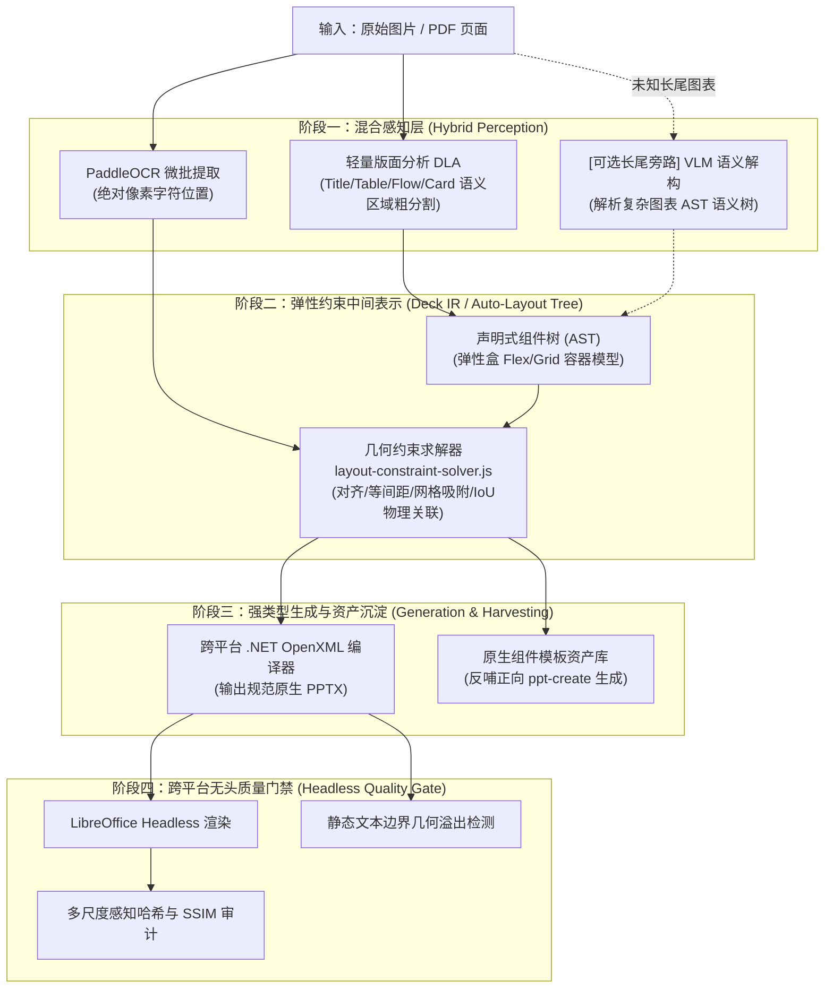

# 通用能力平台架构演进与行业增强方案（Roadmap）

本文档结合 Canva、Gamma、微软研究院（LayoutPrompter / DocEdit）及前沿多模态文档理解（DLA / VLM）工业界最佳实践，对 `common-tools` 当前的架构进行深度对标，并制定系统性的下一代架构演进与增强落地路线。

---

## 一、 方案背景与行业技术对标

### 1. 当前项目的独特优势（行业高地）
- **确定性与零幻觉**：采用本地 PaddleOCR 提取像素级字符坐标，结合 .NET 8 `OpenXmlDeckBuilder` 强类型直接生成，避免大模型“脑补”虚假文字或错位。
- **全链路离线与零 Token 成本**：纯本地轻量算力运行，无外部商业大模型 API 依赖。
- **工业级多级验证闭环**：落地了“OpenXML 编译 -> LibreOffice / PowerPoint COM 真实回写渲染 -> 像素/覆盖率双引擎对比”的质量门禁体系。

### 2. 当前架构的核心瓶颈（长尾诅咒与规则爆炸）
- **启发式规则爆炸**：`slideclone-native-engine` 已膨胀至 450+ 模块。每遇到新的企业架构图、特定流程或矩阵看板，都需要人工分析几何特征并手写上千行 JS 规则。
- **静态坐标脆弱性**：大量使用 `ptBox.x + ptBox.w + 12.5` 这类绝对像素算术，抗文字字数变动、排版抖动的鲁棒性不足。
- **Windows/COM 环境硬绑定**：最严格的编辑回写质检依赖 Windows COM 自动化，制约了标准 Linux 容器和云端 CI 的全量自动化验证。

---

## 二、 架构演进总体蓝图（神经-符号混合架构）

行业前沿正在全面转向**“神经模型看宏观语义，符号约束管微观精度”**的混合架构（Neuro-Symbolic Architecture）：



---

## 三、 五大增强维度的详细技术方案

### 维度 1：引入轻量版面分析（DLA）与 VLM 语义长尾兜底
- **轻量 DLA 目标检测旁路**：
  引入预训练的轻量目标检测模型（如 `PP-StructureV2 Layout` 或 `YOLOv8-Doc`），在 OCR 之后直接定位大粒度语义区块：`[标题区, 表格区, 步骤流向图, 辐射网图, 指标卡片组]`。
  - **收益**：取代几十个手写探测器（`*-detector.js`），大幅削减启发式规则代码量。
- **VLM 辅助长尾解构（可选 Fallback）**：
  针对规则库未命中的复杂版式，采用多模态模型（Claude 3.5 Sonnet 或本地量化 `Qwen2-VL`），仅输出逻辑层级 JSON（如步骤名称、父子嵌套结构），**严禁模型输出绝对坐标**；由本地 `layout-constraint-solver` 负责将语义节点与 PaddleOCR 真实坐标做最近邻吸附。

### 维度 2：从“绝对坐标拼装”升级为“弹性约束盒模型（Flex/Grid IR）”
- **声明式弹性容器树（Auto-Layout Tree）**：
  在生成底层 OpenXML 之前，将卡片、文本、图标组织为具备弹性布局语义的容器：
  ```json
  {
    "type": "horizontal_container",
    "gap": 16,
    "alignItems": "center",
    "children": [
      { "type": "card", "flex": 1, "padding": 12 },
      { "type": "connector_arrow", "width": 24 },
      { "type": "card", "flex": 1, "padding": 12 }
    ]
  }
  ```
- **解除硬编码脚本**：
  新版式的扩展将转化为声明式 JSON Schema 模板配置，彻底解耦“版式拓扑定义”与“几何坐标算术”。

### 维度 3：构建 100% 跨平台的云原生无头质检流水线
- **摆脱 Windows COM 强依赖**：
  - 将 Windows PowerPoint COM 降级为开发机“黄金样本标定”工具；
  - 云端 CI 与标准 Linux Docker 容器内采用 **LibreOffice Headless + pdftoppm** 导出无头渲染图；
  - 结合图像感知哈希（pHash）与结构相似性（SSIM），对原图与重构图执行无头自动化评分。
- **纯几何静态文本溢出分析（Static Text Overflow Analysis）**：
  利用字体度量缓存（Font Metrics），直接计算文字换行后的物理包围盒是否会突破所属容器边界，在编译期精准预测折行与重叠缺陷。

### 维度 4：逆向能力反哺正向设计（Design Asset Harvesting）
- **高质量原生组件沉淀**：
  在 `slideclone` 成功逆向出精美流程图、对比矩阵后，自动剔除具体业务文字，将其向量拓扑与样式参数抽象为**标准组件模板**并入库。
- **赋能正向生成（`ppt-create`）**：
  正向大纲生成工具在遇到“4 阶段实施路线”需求时，直接调取沉淀的高保真原生组件骨架回填文字，实现高质量双向飞轮效应。
- **品牌色盘自适应换肤（Brand Kit Retargeting）**：
  支持导入企业标准配色方案（主色、辅助色、强调色、背景色），在逆向重构时自动将原图颜色映射替换为企业品牌色。

### 维度 5：统一仓储抽象与现代化生态演进
- **统一 JobRepository**：
  全面落地我们在第一阶段定义的 `JobRepository` 规范，对单机文件系统存储与 `team-runtime`（PostgreSQL）提供透明的多态实现。
- **本地单机引入轻量嵌入式存储（SQLite）**：
  替换遍历大量 `.json` 文件的传统机制，在单机保持免运维的前提下实现精确的原子事务、索引查询与租约一致性。
- **模块生态渐进演进**：
  规划向原生 ESM 的平滑过渡策略，确保后续引入现代视觉处理库与 AI 社区前沿依赖无阻碍。

---

## 四、 实施演进路线图（Phased Roadmap）

| 阶段 | 周期 | 核心目标 | 关键交付物 |
| :--- | :--- | :--- | :--- |
| **第一阶段（短期/夯实基础）** | 当前 | 统一契约与几何约束求解 | • `assertJobRepository` 与 `JobStore.list` 规范落地（已完成）<br>• `layout-constraint-solver.js` 布局约束求解器（已完成）<br>• `native-engine-decision-graph.md` 全局决策图谱（已完成） |
| **第二阶段（中期/破除瓶颈）** | 1~2 个月 | 弹性盒模型与跨平台质检 | • 实现 Flex/Grid 声明式中间表示（IR），淘汰手工像素算术<br>• 接入 Linux LibreOffice + SSIM 无头质量门禁<br>• 启动逆向组件模板化（Asset Harvesting）试点 |
| **第三阶段（远期/智能跃迁）** | 3~6 个月 | 神经-符号混合与飞轮闭环 | • 集成轻量 DLA 目标检测器，实现粗版面自动分割<br>• 接入 VLM 辅助长尾未知版式兜底解构<br>• 落地 `ppt-create` 原生组件填充与品牌色盘一键换肤 |

---

## 五、 风险防范与向后兼容策略

1. **坚持分层解耦原则**：所有新增的弹性盒求解、DLA 模型调用均作为可选管道（Pipeline Pass），不破坏现有稳定运行的 OpenXML 强类型底层。
2. **渐进式迁移与测试守卫**：新方案按版式类型逐步灰度推广，必须跑通既有的 430+ 自动化测试套件与质量对比门禁，确保视觉与可编辑性指标不发生任何劣变。
