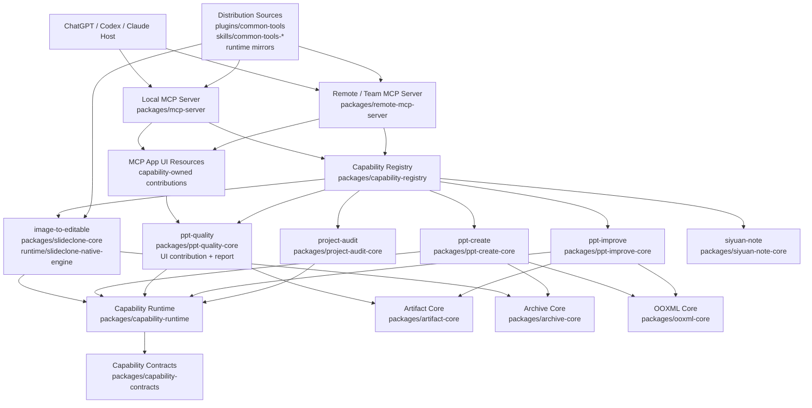

# 通用插件项目架构图与合理性评估

本项目定位为通用插件项目：把日常应用能力统一包装成可发现、可门控、可运行、可展示的能力集合。能力来源包括本地/远程 MCP 工具、Codex skills、运行时 worker，以及面向 ChatGPT/Codex 的轻量 UI，例如 PPT 质量报告。

## 当前合理性结论

整体方向已经合理：主入口现在更像 composition root，能力注册、运行时、协议适配、共享基础设施和 UI 资源已经分层。尤其是能力注册表、共享 archive/OOXML/artifact core、team MCP 工具注册表、能力拥有的 UI contribution，以及 SlideClone 原生运行时镜像，已经把过去“中心文件堆逻辑、skill 目录承担生产依赖”的形态往通用插件架构推进了一大步。

| 评估项 | 当前状态 | 判断 |
| --- | --- | --- |
| 能力发现与门控 | `packages/capability-registry` 统一声明本地能力、工具定义、团队 worker 与分发清单；MCP 层消费注册结果 | 合理 |
| MCP 协议边界 | local/team MCP 主要负责协议、鉴权上下文、工具列表和资源读取；team 工具定义已抽到 `team-tool-registry` | 合理 |
| 共享基础设施 | archive、OOXML、artifact 相关通用逻辑已抽到独立 core 包 | 合理 |
| UI 归属 | 质量报告 UI 已由 `ppt-quality-core` 导出 contribution，MCP 层只汇总与读取 | 合理 |
| Skill / runtime 边界 | 生产不再直接加载 `skills/pd-hifi-slideclone/scripts/rebuild-real-pptx-native.js`，改为 `runtime/slideclone-native-engine` 的受测镜像 | 基本合理，但仍是 legacy runtime mirror，后续可继续瘦身 |
| 分发策略 | `plugin.json`、manifest、skills 镜像与 runtime 镜像已有校验和文档约束 | 合理 |

## 仍建议保留的技术债口径

1. `runtime/slideclone-native-engine` 仍是历史原生引擎的兼容镜像，不应再让新能力依赖它的内部脚本路径。后续应继续把可复用能力拆成稳定包接口。
2. UI contribution 现在已能力化，但如果未来有更多 UI，建议形成统一 `ui-contributions` 聚合约定，例如每个 capability package 暴露同名子路径。
3. 当前旧 A–F 验收文档覆盖的是更大的产品交付闭环，包括远程真实任务、PDF 独立样本和 Office 质量验收；它不等同于本轮通用插件架构五项整改。
