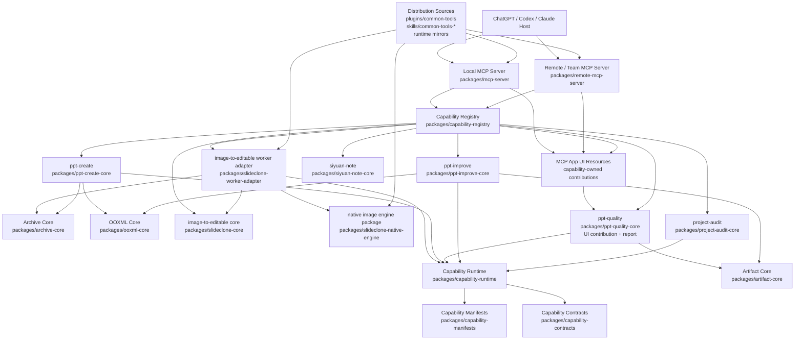

# 通用插件项目架构图与合理性评估

本项目定位为通用插件项目：把日常应用能力统一包装成可发现、可门控、可运行、可展示的能力集合。能力来源包括本地/远程 MCP 工具、Codex skills、运行时 worker，以及面向 ChatGPT/Codex 的轻量 UI，例如 PPT 质量报告。

## 当前合理性结论

整体方向已经合理：主入口现在更像 composition root，能力注册、能力 manifest、运行时、协议适配、共享基础设施和 UI 资源已经分层。尤其是 capability module 聚合、共享 archive/OOXML/artifact core、team MCP 工具注册表、能力拥有的 UI contribution，以及 SlideClone 原生运行时镜像，已经把过去“中心文件堆逻辑、skill 目录承担生产依赖”的形态往通用插件架构推进了一大步。

| 评估项 | 当前状态 | 判断 |
| --- | --- | --- |
| 能力发现与门控 | 各本地 Job 能力包直接导出自己的 `CAPABILITY_MODULE`，`packages/capability-registry` 通过独立 local catalog 聚合、冻结并校验这些模块，统一暴露本地能力、工具 handler、报告 reader 与 UI contribution；registry 加载时会对齐签名 manifest 的 capability、toolNames、runtime range 和 worker profile，并要求每个非 direct manifest 都有本地 module；`siyuan-note-core` 作为 direct remote 能力导出 `REMOTE_CAPABILITY_MODULE`，remote MCP 通过 direct capability catalog 读取 direct tool 参数键、方法映射、服务 owner 与 MCP contract；MCP 层消费注册结果 | 合理 |
| 能力 manifest 事实源 | `packages/capability-manifests` 现在直接导出签名 manifest 读取、版本范围、依赖图、弃用窗口和 hash 校验；`capability-runtime` 只消费已验证目录并处理状态配置 | 合理 |
| MCP 协议边界 | local/team MCP 主要负责协议、鉴权上下文、工具列表和资源读取；team 工具定义已抽到 `team-tool-registry`；本地与团队工具合同共用 `capability-contracts` 的合同构造器；`verify-capability-catalogs` 已进入统一能力门禁，校验 local/direct catalog、签名 manifest 和 direct tool contract 一致性 | 合理 |
| 共享基础设施 | archive、OOXML、artifact 相关通用逻辑已抽到独立 core 包；PPTX ZIP/Inventory 已迁入 `ooxml-core` 并由旧入口兼容转发 | 合理 |
| UI 归属 | 质量报告 UI 已由 `ppt-quality-core` 导出 contribution，经 `capability-registry` 聚合，MCP 层只汇总与读取 | 合理 |
| Skill / runtime 边界 | 生产 Worker 不再依赖 skill 脚本或旧式兼容适配器；图片 worker 编排、归档、文档归一化、质量渲染和 OCR checkpoint 已移到 `@common-tools/slideclone-worker-adapter`；图片重建经 `@common-tools/slideclone-native-engine` 这个受测 package 入口加载包内 engine 实现 | 更合理；历史大实现已收进 workspace package 边界，不再通过顶层 runtime 资产绕过包边界 |
| 分发策略 | `plugin.json`、manifest、skills 镜像与 runtime 镜像已有校验和文档约束；历史 Skill 脚本引用已进入 decreasing-only 迁移预算 | 合理 |
| 架构治理 | workspace layer policy 已从脚本 if 条件抽到 `config/layer-policy.json`；精确 sibling package dependency policy 已抽到 `config/workspace-package-policy.json`，边界 verifier 读取声明式策略并阻止包漂移；native engine payload 由 `config/native-engine-runtime-payload.json` 声明并通过 `scripts/native-engine-runtime-payload.js` 接入 lint 门禁；remote MCP 配置解析已从入口抽到独立模块 | 合理 |

## 仍建议保留的技术债口径

1. `packages/slideclone-native-engine/scripts` 仍镜像历史原生引擎实现，但已位于 package 边界内，并由 native engine payload manifest 校验入口、目录、根脚本和禁止回潮路径；后续如果要继续瘦身，应按业务能力迁移到稳定包接口，而不是恢复旧式兼容适配入口。
2. `slideclone-core` 已从 team worker 编排中解耦，但内部仍有若干历史命名模块；后续优化应按“算法能力面”继续收敛命名与 exports，而不是把生产编排放回 core。
3. local 与 direct remote 的 capability module 已经下放到能力包导出，registry 入口通过独立 local catalog 消费本地能力模块，remote MCP 通过 direct capability catalog 消费直连能力模块，SiYuan 这类 direct remote tool 的参数键、服务 owner、方法映射和 MCP contract 也由能力包拥有；下一步如果继续增强，可把这些 catalog 升级为生成物，进一步减少新增能力时的人工同步。
4. `skills/pd-hifi-slideclone/scripts` 的历史引用已从 441/273 降到 418/266 并纳入预算；后续应持续按小组迁移并 ratchet，不应一次性大爆破。
5. 当前旧 A–F 验收文档覆盖的是更大的产品交付闭环，包括远程真实任务、PDF 独立样本和 Office 质量验收；它不等同于本轮通用插件架构五项整改。
