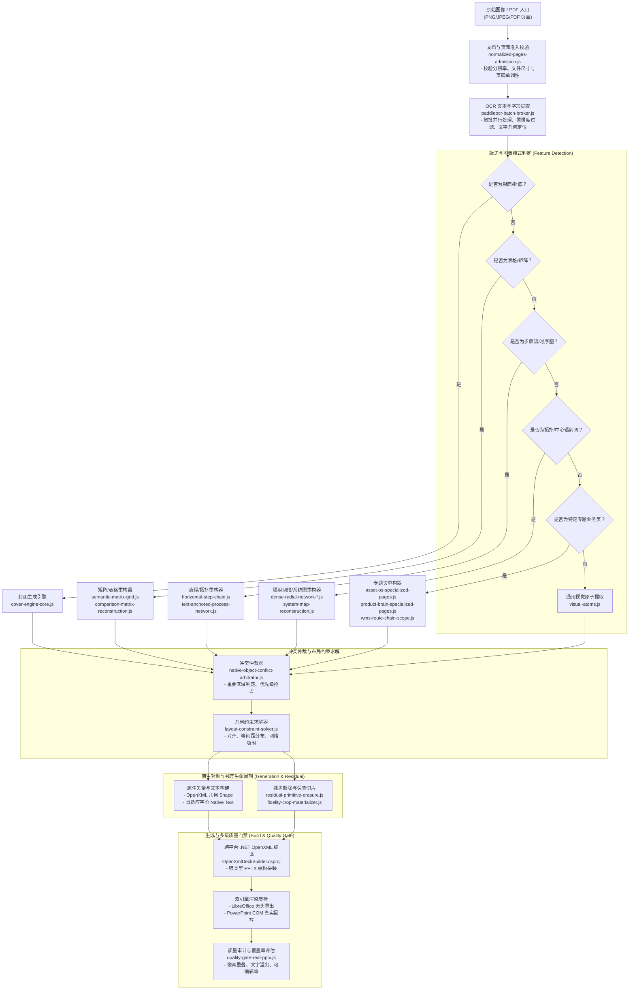

# Native Engine 版式识别决策流与分发图谱

本文档系统化阐明 `packages/slideclone-native-engine` 与 `packages/slideclone-core` 内部的高保真图片/PPT 逆向还原架构，梳理页面从输入到原生可编辑 PPTX 生成的核心决策树（Decision Tree / Pipeline Dispatch Graph）。

---

## 一、 端到端重建决策全景图



---

## 二、 阶段职责与核心模块映射表

| 阶段 | 核心模块 | 输入契约 | 产出物 | 职责描述 |
| :--- | :--- | :--- | :--- | :--- |
| **1. 图像准入** | `normalized-pages-admission.js` | 原始文件路径或 Buffer | 严格规整的 PNG 页面索引 | 拦截超限页面（单 deck ≤ 100 页）、校验长宽比与图片完整性 |
| **2. OCR 与字形** | `paddleocr-batch-broker.js`<br>`ocr-source-deck.js` | 规范化 PNG 图片 | `DeckIR.pages[].textBlocks` | 进程池常驻管理、微批识别文字坐标、置信度清洗与文本框微调 |
| **3. 封面与背景** | `cover-engine-core.js`<br>`decorative-cover-graphics.js` | 页面色彩直方图、大字号标题 | `NativeCoverLayer` | 提取主轴配色、卡片边距，判断是否需使用渐变原生底板 |
| **4. 矩阵与对比** | `comparison-matrix-reconstruction.js`<br>`semantic-matrix-grid.js` | 连续行/列对齐文本框、分割线 | `NativeTable` / `MatrixGrid` | 识别双轴对比矩阵、四象限分布图与多行多列表格 |
| **5. 流程与拓扑** | `horizontal-step-chain.js`<br>`triangle-topology.js` | 箭头、连线、同构卡片序列 | `NativeProcessChain` | 识别水平流向图、里程碑时序链与三角循环拓扑 |
| **6. 放射与系统图**| `dense-radial-network-*.js`<br>`system-map-reconstruction.js` | 核心中心圆/徽章、向外发散节点 | `NativeRadialGraph` | 识别中心环绕系统架构图、全景网络拓扑图 |
| **7. 专题业务页** | `asset-os-*.js`<br>`product-brain-*.js` | 特化领域语义文本匹配 | `DomainSpecializedLayer` | 处理指标卡、断点说明看板、PRD 自动生成等特定高频版式 |
| **8. 冲突仲裁** | `native-object-conflict-arbitrator.js` | 多 Rebuilder 产生的候选重叠集 | 唯一胜出的对象化方案 | 基于面积覆盖度、文本完整性与置信度裁决优先权 |
| **9. 几何约束** | `layout-constraint-solver.js` | 候选对象包围盒 | 规范对齐/均分坐标 | 对齐左/中/右/顶/底，等间距重排，网格微调吸附 |
| **10. 残差生命周期**| `residual-primitive-erasure.js`<br>`fidelity-crop-materializer.js` | 已原生化的区域、原图残差 | 擦除后残差图 / 保真切片 | 剔除已被原生图形覆盖的背景残余，复杂插画保留保真切片 |
| **11. PPTX 构建** | `OpenXmlDeckBuilder.csproj`<br>`openxml-build-jobs.js` | 结构化 `DeckIR` JSON | 原生 `.pptx` 二进制文件 | 基于 .NET 8 强类型快速写入 OpenXML 结构包 |
| **12. 质量门禁** | `quality-gate-real-pptx.js`<br>`pptx-editability-classifier.js` | 生成的 `.pptx` 与基准原图 | `QualityReport` (通过/未通过) | 校验真实渲染图像偏差、文字可编辑率（≥85%）与防折行安全 |

---

## 三、 候选重构器冲突仲裁规则（Precedence & Arbitration）

当一页幻灯片同时包含多种特征（例如：既有卡片列表，又有放射箭头，且包含表格）时，仲裁器遵循以下规则裁决：

1. **确定性模板优先（Deterministic Specialty Precedence）**：
   - 特殊业务页模板（如封面三件套、四象限 KPI 看板）拥有最高优先权。
2. **结构化容器优先于视觉碎片（Structural Container Over Fragments）**：
   - 识别出的 Table/Matrix 容器高于零碎的散落卡片；
   - 识别出的 Step Chain 高于散落的普通矩形 Shape。
3. **不可分复杂插画降级为保真残差（Fidelity Residual Fallback）**：
   - 当某图形区域的向量拓扑过于复杂、且包含不可提取渐变插画时，系统**拒绝强行拆分**，而是物化为高保真 PNG 贴图（Crop），并在其上方叠放原生可编辑文字图层。

---

## 四、 声明式布局约束求解器集成指引

在新增版式或重构现有 `native-rebuild-*.js` 模块时，应统一采用 `@common-tools/slideclone-core/layout-constraint-solver` 替代分散的手工坐标计算：

```javascript
const {
  alignBoxes,
  distributeBoxes,
  solveGridLayout,
  computeEnvelope,
  snapBox
} = require("@common-tools/slideclone-core/layout-constraint-solver");

// 1. 针对 N 个同构卡片自动求解网格排版
const gridCells = solveGridLayout(slideContentBounds, cards.length, {
  cols: 3,
  gapX: 16,
  gapY: 20
});

// 2. 针对一组文本框进行左对齐与等间距重排
const leftAligned = alignBoxes(textBoxes, "left");
const evenlySpaced = distributeBoxes(leftAligned, "vertical", { gap: 12 });
```
