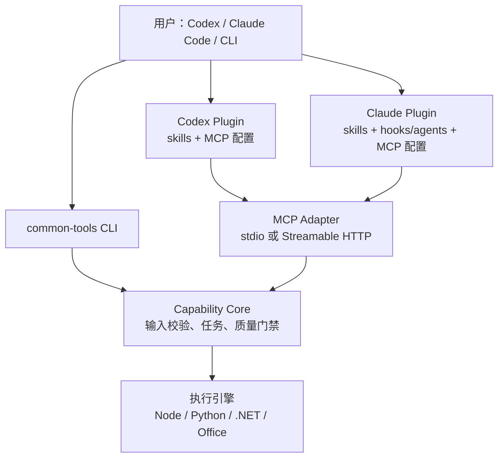
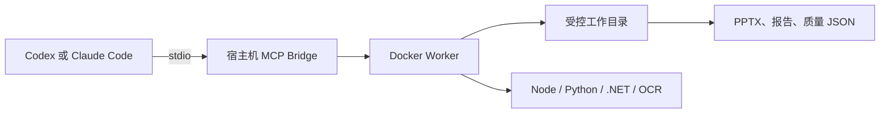
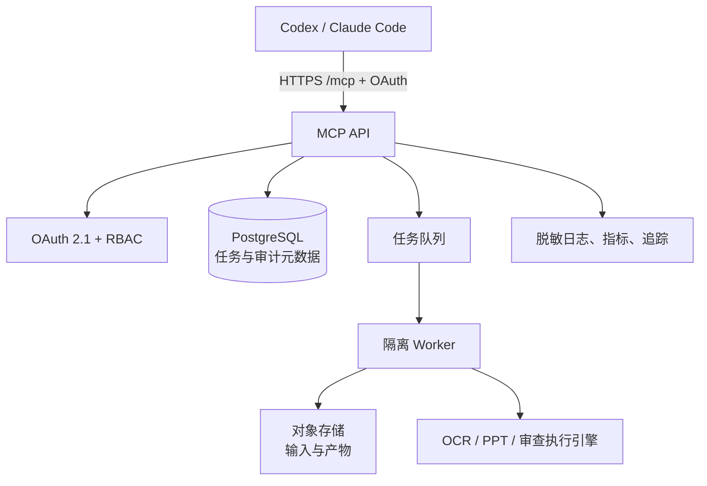
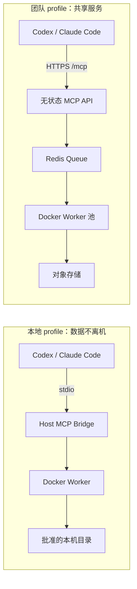

# 通用能力平台：架构、分发与部署方案

> 状态：设计草案（v4，已整合 Docker、基础 MCP `2025-11-25`、Tasks `2026-06-30` 与无状态 MCP `2026-07-28` 兼容）
> 目标：将本仓库从单一 PPT 可编辑化工具，演进为可在 Codex、Claude Code 及命令行环境中复用的通用能力平台。

## 1. 决策摘要

采用 **核心能力独立、Skill 编排、MCP 工具化、Plugin 分发适配、Docker 统一运行时** 的分层架构：

1. 业务和算法必须位于与宿主无关的核心能力包中；不得复制到 Codex 或 Claude 插件。
2. 本地优先：图片/PPT/源代码默认不离开用户设备；宿主机 `stdio` MCP Bridge 调度本机 Docker Worker。
3. 远程部署只服务于协作、外部系统访问和需要集中计算的场景；使用无状态 HTTPS MCP、异步任务和受控对象存储。
4. Codex 与 Claude Code 使用各自的薄插件和分发目录；二者仅共享核心包、能力契约和测试夹具。
5. 第一批能力为 `image-to-editable`（从现有 `pd-hifi-slideclone` 演进）、`project-audit`、只读 `ppt-quality` 与副本式 `ppt-improve`；审核和修复严格分离。



### 1.1 MCP 新版兼容基线

远程 MCP 对基础工具面继续兼容 `2025-11-25`，并为明确协商的团队客户端支持 `2026-06-30` Tasks 投影及 `2026-07-28` 的无状态 HTTP 边界。协议版本、扩展能力和请求头都按**每个请求**验证；未协商或不支持 Tasks、MCP Apps 的 Codex、Claude Code 或其他客户端始终获得相同的基础 Job 工具结果。结构化 elicitation、Tasks notifications 等未实现扩展不得被声明或假定可用。规范站点当前的 `DRAFT-2026-v1` 也不在支持列表，服务会失败关闭；其订阅、通知及 `input_required` 交互流必须等定稿后连同可恢复的无状态请求关联一并评审，不能仅因名称相近而冒充支持。

| 新能力 | 本平台方案 | 不支持时的降级 |
|---|---|---|
| 无状态 Streamable HTTP | API 不保存 MCP session；任一副本可处理请求 | 由 SDK transport 适配旧协议，业务层不保存会话 |
| Tasks Extension | 团队 backend 在协商 `2026-06-30` 或 `2026-07-28` 且客户端 opt-in 后支持 `get`、`cancel`；当前 Job 在创建时必须包含完整输入，因此 `tasks/update` 会明确拒绝，`server/discover` 仅在协商时声明 | 返回平台 `jobId`，调用 `get_team_job` / `cancel_team_job` |
| 结构化追问（elicitation） | 尚未实现；当前无状态单请求 transport 不支持在原始 `tools/call` 处理中安全关联 server→client 嵌套请求，Job 输入在创建前必须完整。未来仅可在客户端声明 `elicitation` 能力、transport 能保留请求关联且表单不收集 Secret 时启用；需要第三方凭据时必须走用户确认的 URL 模式 | 拒绝缺失参数，不猜测 |
| MCP Apps | 已提供受协商的只读质量报告 `ui://` resource；本地 `image-to-editable` 成功 Job 可附带经 SHA-256 校验的视觉摘要，本地 stdio 与团队远程 API 都可通过 `resources/read` 获取，界面只渲染现有 Job 结构化结果 | 不附加 UI metadata，继续返回同一份 `structuredContent` 与文本摘要 |
| 路由、缓存与追踪 | `2026-07-28` 要求 `Mcp-Method`，对 tools/tasks 校验 `Mcp-Name`；`tools/list` / `server/discover` 返回 30 秒私有缓存提示；只持久化严格 `_meta.traceparent` | 旧协议不要求路由头、不带缓存字段，并继续使用基础 Job API |

平台 `Job` 是领域对象，独立于 MCP；MCP Task 只是客户端支持时的协议投影。这样 CLI、本地 Docker、远程 API 与旧客户端均可可靠恢复任务。

## 2. 概念与边界

| 层 | 负责什么 | 不负责什么 | 示例 |
|---|---|---|---|
| 核心能力（core） | 输入校验、任务执行、产物、质量门禁、错误码 | 模型提示词、宿主安装方式 | PPT 解析、OCR、生成 PPTX、项目规则扫描 |
| CLI | 人和脚本直接调用核心能力 | 对模型提供工具元数据 | `common-tools editable run` |
| MCP Server | 将稳定能力以 schema 化工具暴露给模型 | 存放业务规则或绕过授权 | `create_editable_job` |
| Skill | 告知模型何时使用能力、如何分步、怎样验收 | 承担实时业务逻辑 | `image-to-editable/SKILL.md` |
| Plugin | 打包、安装、配置 skills/MCP/hooks | 成为核心能力唯一运行位置 | Codex、Claude 各自插件 |
| Marketplace | 发现、版本管理和分发插件 | 执行用户任务 | Codex / Claude 团队 marketplace |

### 2.1 什么时候用 Skill

Skill 适用于可重复的“工作方法”，例如：审视项目、图像转可编辑、PPT 质量修复。它应包含前置条件、输入收集、调用顺序、输出格式、验收标准和失败处理。

Skill 不应持有密钥，不应直接实现转换算法，也不应依赖目录外未打包的文件。

### 2.2 什么时候用 MCP

当能力需要实时执行、访问受控文件、调用 OCR/PPT 引擎、连接 GitHub/CI/Sentry 或查询任务进度时使用 MCP。工具应小而单一，输入与输出必须显式 schema 化。

对于耗时操作，MCP 不应同步等待完成；必须创建异步任务并轮询状态。

### 2.3 什么时候用 Plugin

Plugin 用于把相关的 Skill、MCP 配置、可选 hook/agent 组合成可安装产品。Codex 与 Claude Code 的插件格式和市场机制不同，因此采用两个适配包，不追求“一个 manifest 同时兼容两端”。

## 3. 目标能力

### 3.1 `image-to-editable`

**目标**：将 PNG/JPG/PDF/PPT 页面转换为可编辑 PPTX，并输出可追溯质量报告。

输入包括受允许目录中的文件、目标格式、保真策略与资源限制。输出包括任务 ID、产物清单、编辑性/视觉质量报告、失败原因及可恢复建议。

现有 `skills/pd-hifi-slideclone` 的 Node、Python、.NET 与 OpenXML 适配器将逐步下沉到此能力的执行引擎层。迁移期间保持现有 CLI 与配置文件兼容。

### 3.2 `project-audit`

**目标**：对一个项目进行证据化审视，输出架构、质量、安全、依赖、可维护性与交付门禁报告。

### 3.3 `ppt-quality`

**目标**：只读检查单个 `.pptx` 的 OOXML/ZIP 结构与可编辑对象分布，生成独立 `ppt-quality-report.json` 和 `ppt-quality-report.md`，绝不修改输入文件。本机 CLI/stdio MCP 与可选团队 Docker Worker 均支持该能力；团队 Worker 仅接收单一受限 PPTX 上传并生成 owner/job-scoped报告。

首版检查受限 ZIP 目录及中央目录/本地条目的 CRC-32 一致性、必需的 presentation/slide XML、页数、文本形状、图片、表格、媒体、孤儿媒体、备注、空页及内部 OOXML relationship 完整性；关系检查只汇总关系数、无法解析数和非法路径数，不读取外部 URL，也不回显关系目标。报告仅含 SHA-256、大小和有界计数，不回显幻灯片文字、路径或二进制内容。本地同步命令为 `common-tools ppt-quality run --input <deck.pptx> --out <report-dir>`；需要异步控制时使用 `create` 后接 `common-tools job run --id <job-id>`。MCP 对应 `create_ppt_quality_job`、`get_ppt_quality_report`。

### 3.4 `ppt-improve`

**目标**：读取同一 PPTX 的、SHA-256 一致的 `ppt-quality` 报告，执行范围明确的无损结构修复，且只在有安全修复时创建新的 `improved.pptx`，随后在内部复审。

改善能力采用受控 profile：`safe-package` 删除未被任何 OOXML relationship 引用的 `ppt/media/*` 孤儿媒体；`layout-safe` 只修复同一页内重复的非视觉 drawing ID；`typography-safe` 只为缺失语言元数据的中英文文本 run 补充语言标记；`editability-safe` 只为缺失名称的可编辑对象补充稳定名称；`audit-only` 不生成修改副本。后三项不移动对象、不改字体外观、不重写文案。所有 profile 都不会覆盖输入文件。本地同步命令为 `common-tools ppt-improve run --input <deck.pptx> --report <ppt-quality-report.json> --out <improve-dir> --profile <profile>`；需要异步控制时可先 `create` 再运行 Job。若需要完整本地工作流，`common-tools ppt-improve pipeline --input <deck.pptx> --out <new-pipeline-dir> --profile <profile>` 会先生成 `quality/ppt-quality-report.json/.md`，只在审查 Job 成功后以该报告创建 `improve/` Job；输出根必须此前不存在，避免覆盖既有审核或改善工件。MCP 对应 `create_ppt_improve_job`、`get_ppt_improve_report`。可选团队 Worker 采用单一 PPTX 输入，在受限临时目录内自行生成与输入 SHA-256 绑定的初审报告，再执行相同 profile；因此不会接受调用方提供的报告、修复脚本或路径。有安全候选时除 `improved.pptx` 和改善报告外，还会生成与新副本 SHA-256 绑定的 `improved-ppt-quality-report.json/.md`；所有目标名采用排他创建。没有安全候选时只生成独立改善报告，不伪造新的 PPTX 或复审。视觉重排、文案改写和字体外观调整仍不属于这些安全 profile。

第一版仅作本地只读审查：收集项目清单、锁文件、测试/构建结果和静态规则证据。涉及 GitHub PR、线上告警、私有知识库时，再由独立 MCP 工具接入并单独授权。

输出必须区分：事实证据、推断、风险等级、修复建议和未覆盖范围；不得将模型猜测写成扫描事实。

## 4. 推荐目录结构

采用渐进式 monorepo，而非一次性迁移所有现有脚本：

```text
common-tools/
  packages/
    capability-contracts/       # TypeScript 类型、Zod schema、错误码、审计事件
    capability-runtime/         # 任务生命周期、路径策略、工件与质量门禁
    slideclone-core/            # 从 pd-hifi-slideclone 抽出的稳定核心
    project-audit-core/         # 规则、证据采集器、报告生成器
    ppt-quality-core/           # 只读 PPTX OOXML 结构审计、独立报告生成器
    ppt-improve-core/           # 仅报告约束下的副本式 PPTX 结构修复
    cli/                        # common-tools 命令行
    mcp-server/                 # MCP 的本地/远程 transport 适配
  deploy/                       # Dockerfile、compose profile、healthcheck
  skills/
    image-to-editable/
      SKILL.md
      references/
      assets/
    project-audit/
      SKILL.md
      references/
  plugins/
    codex/
      .codex-plugin/plugin.json
      skills/                   # 仅宿主适配后的 skill 副本/生成物
    claude/
      .claude-plugin/plugin.json
      skills/
      hooks/
  marketplaces/
    codex/.agents/plugins/marketplace.json
    claude/.claude-plugin/marketplace.json
  docs/
  skills/pd-hifi-slideclone/    # 过渡期保留，后续内部调用 slideclone-core
```

`skills/` 中的通用源文件可通过构建脚本复制或渲染到两个插件目录；插件安装时可能被复制到缓存，故不能通过 `../` 引用核心逻辑或公共文档。

## 5. 统一能力契约

### 5.1 任务模型

所有可能超过 10 秒的能力统一使用任务模型：

```ts
type JobStatus =
  | "queued"
  | "running"
  | "input_required"
  | "cancel_requested"
  | "succeeded"
  | "failed"
  | "cancelled"
  | "expired";

interface CapabilityJob {
  id: string;
  capability: "image-to-editable" | "project-audit" | "ppt-quality" | "ppt-improve";
  status: JobStatus;
  ownerId: string;
  idempotencyKey: string;
  attempt: number;
  maxAttempts: number;
  createdAt: string;
  updatedAt: string;
  expiresAt: string;
  lease?: { workerId: string; heartbeatAt: string; expiresAt: string };
  inputRequest?: { id: string; schema: unknown; message: string; expiresAt: string };
  artifacts: Array<{ name: string; mediaType: string; uri: string; sha256: string }>;
  quality?: { passed: boolean; checks: Array<{ name: string; passed: boolean }>; metrics: Record<string, number> };
  error?: { code: string; message: string; retryable: boolean };
}
```

每个能力的 request、result、quality report、error 均由 `capability-contracts` 定义，并在 CLI、MCP、单元测试中共享。本地与团队路径的 quality report 均固定为 `passed`、去重且固定命名的 `checks[]` 与有界数值 `metrics`，不允许任意文本、路径、源码片段或模型原始输出进入 Job/MCP 响应；本地图片任务必须产出至少一个 PPTX 才会成功，项目审计则以扫描/报告生成是否成功作为运行质量、把发现数量保留为指标而非伪装为执行失败；旧版不符合此契约的已持久化团队 quality JSON 读取时降为 `null`。边界输入使用 `zod` 解析、coerce、validate 与 sanitize；未知输入使用 `unknown`，不得以 `any` 绕过验证。

状态机必须显式限制迁移：`queued → running`、`running → input_required | cancel_requested | succeeded | failed`、`input_required → queued | cancel_requested | expired`、`cancel_requested → cancelled | succeeded | failed`。仅调度器可领取 `queued` 任务；仅持有未过期 lease 的 Worker 可写入运行结果；所有终态仅允许一次写入。相同 capability、owner、idempotency key 和规范化输入在有效期内必须返回同一 Job。

### 5.2 MCP 工具面

首版工具集：

| 工具 | 目的 | 写入性 |
|---|---|---|
| `health_check` | 发现本机依赖、版本和可用能力 | 只读 |
| `create_editable_job` | 创建转换任务 | 写入受控任务目录 |
| `get_job` | 查询状态、质量与简要错误 | 只读 |
| `cancel_job` | 请求协作取消平台 Job | 修改任务状态 |
| `list_job_artifacts` | 枚举受控产物 | 只读 |
| `run_project_audit` | 创建本地只读审查任务 | 只读源码，写报告 |
| `get_audit_report` | 获取结构化审查报告 | 只读 |

工具名称、描述、输入输出 schema 和安全注解是公开契约。读工具标记 `readOnlyHint: true`；可产生文件或外部副作用的工具不可声明为只读。服务端必须独立执行权限检查，不能相信模型或安全注解。

### 5.3 路径与工件策略

- 仅允许通过显式注册的 workspace root、任务输入目录和任务输出目录访问文件。
- 请求中的路径先解析为规范绝对路径，再验证其位于允许根目录内；拒绝符号链接逃逸、设备路径和路径遍历。
- 每个任务创建唯一工作目录，产物以 SHA-256 记录；不以用户提供的文件名作为最终存储键。
- 默认保留期和清理策略必须可配置；远程模式应使用可追踪、可撤销的对象存储生命周期规则。

## 6. 部署方案

### 6.1 阶段 A：本地优先 Docker 部署（默认）

适用：图片/PPT 转换、本地源代码审视、办公软件自动化、含敏感文件的工作流。



宿主机 Bridge 只负责 stdio MCP 和受限任务调度，不向模型暴露 Docker socket 或任意容器参数。Docker Worker 使用批准的 bind mount 或 named volume，并以非 root 用户运行。安装包负责声明 Node 依赖；Python 和 .NET 依赖沿用当前可验证的锁定流程。`common-tools doctor` 会检查 Node、Python、.NET、Docker daemon、OCR、工作目录读写权限，以及插件状态和项目 `.common-tools/runtime.json` scope；OCR 同时识别本地 PaddleOCR、Tesseract 与 Umi PaddleOCR JSON。输出中的 `required`、`blocking` 和 `executable` 决定是否可执行，`runtime` 仅给出已启用/实际生效的 capability 范围。插件或项目 Runtime 配置不合法时，该检查失败关闭且不会回显配置内容或路径。`optionalAccelerators` 只报告 OCR provider 是否可用和来源类型，绝不回显可执行文件路径。

本地 Bridge 同时保留 legacy `initialize` 回退，并支持 MCP `2026-07-28` 的无状态 `server/discover`：新版客户端在每个请求 `_meta` 声明协议版本后，可读取 `supportedVersions`、`resultType` 与结果 `_meta` 的 server identity，无需建立初始化会话。它不声明 Tasks 或交互式输入，因为本地 Job 仍以 CLI/MCP 基础工具面为准；远程团队服务才按显式 capability 协商 Tasks。根 Runtime 包提供受限 `npm pack` 文件白名单和 `common-tools` bin，因此可先作为 `private` tarball 在内网/离线环境安装；白名单只收录运行脚本、schema 与 .NET 源码/锁文件，明确排除示例、测试、临时目录和本机构建 `bin`/`obj`。发布门禁 `common-tools:verify-runtime-package` 还会在系统临时目录真实打包、隔离安装，并运行 CLI help 与插件分发校验；该检查已进入 `verify:ci`，以避免白名单看似正确但安装包缺运行时依赖。公开或组织 registry 发布必须在确定正式 scope、registry 和签名策略后另行启用，不能把开发工作区或测试/临时工件直接打包发布。

推荐命令面：

```powershell
npm install -g @your-org/common-tools
common-tools doctor
common-tools mcp serve
common-tools editable create --input .\input --out .\runs\job-001
common-tools audit run --root . --out .\runs\audit-001
```

Codex 和 Claude 插件只需配置其 MCP 客户端启动以上 `mcp serve` 命令。

CLI 的 `editable run`、`audit run`、`ppt-quality run` 与 `ppt-improve run` 是本机同步便捷入口：它们先创建受相同状态机约束的 Job，再只在 Job 仍为 `queued` 时于当前进程执行并返回终态结果。MCP 继续只暴露创建、读取、取消和工件查询等异步 Job 工具；需要轮询、取消、跨进程恢复或团队执行时，不应以 CLI `run` 替代 MCP Job 生命周期。

### 6.2 阶段 B：团队共享的远程部署

适用：多人共享计算资源、与 GitHub/CI/Sentry 等外部系统集成、集中审计、超出本机容量的任务。



远程 MCP 端点建议固定为 `https://tools.example.com/mcp`，采用 Streamable HTTP。API 与 Worker 使用独立身份和最小权限：API 无法直接读取原始文件，Worker 只能读取被分配任务的前缀，下载通过短期签名 URL 或经过授权的工件代理完成。

### 6.3 远程基础设施选择

| 关注点 | 推荐起步方案 | 规模化替换 |
|---|---|---|
| MCP API | Node.js 容器服务 | Kubernetes Deployment / 多区域服务 |
| Worker | Docker worker | Kubernetes Job / 专用 Windows worker 池 |
| 队列 | Redis + BullMQ | 托管 Redis / 消息队列 |
| 元数据 | PostgreSQL | 托管 PostgreSQL + 备份恢复演练 |
| 文件 | S3 兼容对象存储 | 带区域、生命周期和 KMS 的对象存储 |
| 密钥 | 云 Secret Manager | 同左，增加轮换与审计 |
| 可观测性 | 结构化日志 + metrics | OpenTelemetry + 集中告警 |

Windows 专用 Worker 仅可承载无界面且许可允许的引擎；PowerPoint COM 不属于无人值守 Docker 或团队 Worker profile。COM 仅限用户本机、交互式 Windows 会话中的可选加速器。任务以不可变输入和工件 URI 交接，避免跨平台共享本地路径。

## 7. 宿主与分发

### 7.1 Codex

Codex 插件应包含 `.codex-plugin/plugin.json`、面向 Codex 的 skills，以及 MCP 连接信息。每项 capability 是独立插件目录，可只安装所需能力；manifest 必须提供 author 和安装页 `interface` 元数据。`marketplaces/codex/.agents/plugins/marketplace.json` 是团队本地市场，条目指向各自独立的插件副本；首次添加市场、随后按 capability 安装：

```powershell
codex plugin marketplace add .\marketplaces\codex
codex plugin add image-to-editable@common-tools-codex
# 或：codex plugin add project-audit@common-tools-codex
# 或：codex plugin add ppt-quality@common-tools-codex
# 或：codex plugin add ppt-improve@common-tools-codex
```

先用 `codex plugin marketplace list` 确认市场名，避免在未知同名市场中安装。更新既有 Codex 插件时只更新对应目录并刷新 `version` 的 `+codex.<cachebuster>` 构建后缀，以便客户端重新加载，不得复制核心业务代码或引用包外文件。初期使用本地 marketplace 进行开发与验证；稳定后发布到团队或公共插件目录。需要实时、认证或受控操作时，插件连接 MCP；单纯方法论只使用 skills。

### 7.2 Claude Code

Claude 插件包含 `.claude-plugin/plugin.json`；由 `marketplaces/claude/.claude-plugin/marketplace.json` 发现和安装。技能需要命名空间并且所有依赖文件都打入插件目录。发布前使用：

```powershell
claude plugin validate .\marketplaces\claude
claude plugin marketplace add .\marketplaces\claude
```

### 7.3 发布与版本策略

- 核心 CLI、MCP 和每个插件使用语义化版本；MCP 工具名与必填字段在一个主版本内保持兼容。
- 每次 CI 生成由锁文件派生、可复现的 SPDX SBOM 工件；发布流程还必须附带变更日志、测试报告和镜像/工件哈希。
- Plugin 使用固定版本或不可变 git SHA；生产环境禁止跟随未审核的分支头。
- 先发布核心包，再发布两个适配插件；插件声明与其兼容的核心 CLI 最小版本。

### 7.4 多插件与按需安装

平台采用“一个共享 Runtime，多个独立能力插件”的产品形态。用户安装某个能力插件后，只获得该能力的 Skill、规则、模板及最小 MCP/CLI 配置；不应被迫加载无关的 PPT、Office、审计或外部系统能力。

```text
common-tools-runtime                 # CLI、Docker Worker、MCP Server、能力注册表
├─ image-to-editable-plugin           # 图片/PDF/PPT → 可编辑文件
├─ project-audit-plugin               # 本地/远程项目审视
├─ ppt-quality-plugin                 # PPT 质量评估与修复
└─ ppt-improve-plugin                  # 副本式 PPT 结构修复与复审
```

推荐目录结构：

```text
plugins/
  codex/
    image-to-editable/
    project-audit/
    ppt-quality/
    ppt-improve/
  claude/
    image-to-editable/
    project-audit/
    ppt-quality/
    ppt-improve/
marketplaces/
  codex/
    .agents/plugins/marketplace.json  # 每项能力可按名称独立安装
  claude/
    .claude-plugin/marketplace.json   # 每项能力作为独立条目
```

Claude marketplace 将每个能力作为可独立安装的条目，例如：

```text
/plugin install image-to-editable@your-org-tools
/plugin install project-audit@your-org-tools
```

Codex 也以每个能力一个独立插件目录发布或从 `common-tools-codex` 市场中安装；市场名称在安装命令中显式指定，避免与其他市场混淆。两个宿主各自维护 manifest；通用源 Skill 可经构建步骤复制到插件目录，但插件不得引用目录外文件。

仓库通过 `npm run common-tools:verify-plugins` 把这条边界变成发布门禁：它从 `packages/capability-manifests/` 枚举每个已声明 capability，要求同时存在独立的 Codex 与 Claude 包和两个市场中的对应条目，校验名称、含可选 build metadata 的语义版本、Skill front matter、Codex 安装页 metadata、市场安装策略，并逐字节比对源插件与两个市场副本。校验会拒绝符号链接、包外相对路径、`file://` 引用及任何 marketplace 漂移；该命令进入统一 CI。因此“只安装一个插件”不是仅靠文档约定，而是可重复验证的分发产物。

运行时还提供不写入本地状态的发现与校验命令，便于安装前核对能力、Worker profile、工具面和对应宿主市场；`runtimeEnabled` 只代表本机 Runtime 的授权开关，**不**声称 Codex 或 Claude 客户端已安装插件：

```powershell
common-tools plugin list
common-tools plugin verify
```

`plugin list` 会先执行同一份分发完整性校验，任一 marketplace 副本漂移、引用包外文件或 manifest 缺失时失败关闭；输出中的 `install.codex` 与 `install.claude` 是各能力的精确市场坐标，`team` 给出由 manifest 约束的 OAuth scope 与允许上传 MIME 类型。`plugin verify` 还会校验每个 manifest 的 `toolNames` 与本地 MCP 注册表严格一一对应，拒绝“插件可安装但工具未注册”、孤儿工具、重复工具或过期工具声明；它适合发布流水线和离线交付验收。

新增第三方或内部 capability 时，先使用默认只预览的 bundle 生成器。它会创建自包含的 Codex/Claude 包、两个独立 marketplace 镜像、以及**不可直接激活**的 draft manifest；只有显式 `--write` 才会写入一个此前不存在的目标目录：

```powershell
common-tools plugin scaffold --name design-review --out .\drafts\design-review
common-tools plugin scaffold --name design-review --out .\drafts\design-review --write
```

生成物可以作为独立、仅 Skill 的草稿 marketplace 安装和评审，但不会自动进入 `packages/capability-manifests/`、本地 MCP 工具表、团队 allowlist 或 Worker。要让它成为可执行 capability，必须实现受限 handler/Worker、补齐正式 manifest 的哈希和版本、复制经验证的 host package/mirror，再通过 `common-tools:verify-plugins` 与完整回归。这样避免把模板、空实现或模型文本错误地当成已授权执行能力。

#### 运行时依赖与工具可见性

本地第一版中，独立插件的 Skill 直接调用版本受控的 `common-tools` CLI；例如只安装 `project-audit-plugin` 时，默认使用 `common-tools audit run ...` 在本机生成报告。`project-audit` 仅在用户明确选择团队留档或隔离执行时走远程 MCP Job；静态审计不得为了默认路径而打包上传代码。只有用户明确授权的本机 `--run-gates` 才会执行已声明的质量脚本，报告必须区分静态观察、真实门禁与未验证项。Docker Worker 按实际 capability 拉取或启动，避免因未安装 PPT 能力而安装 Office/OCR 依赖。

启用 MCP 时，多个插件连接同一个 `common-tools` Runtime/MCP 服务，不为每一个插件启动重复的 MCP 进程。Runtime 保存已启用 capability scope，并在 `tools/list` 与实际工具调用两个层面进行限制：

1. `tools/list` 仅枚举已安装插件、当前用户和当前项目获准的工具。
2. 每次 `tools/call` 再次验证 capability scope，不能因客户端缓存或伪造工具名绕过限制。
3. 远程团队版还需叠加用户、项目、角色、授权 scope 与套餐/配额限制。

工具注册表应将每个工具映射到唯一能力，而不是按插件名称进行字符串判断：

```ts
interface CapabilityRegistration {
  capability: "image-to-editable" | "project-audit" | "ppt-quality" | "ppt-improve";
  toolNames: readonly string[];
  minimumRuntimeVersion: string;
  requiredWorkerProfile?: "base" | "ocr";
  requiredHostFeature?: "interactive-office";
}
```

`common-tools-runtime` 负责兼容性检查和安全启动；能力插件只声明其所需 Runtime 最低版本，插件之间不建立业务依赖。若某能力需要可选的 OCR 或 Windows 交互式组件，`doctor` 和安装流程必须指出缺失项及可用降级路径。

#### 安装状态、升级与卸载

Runtime 不从 Skill 文本、插件名称或 MCP 客户端缓存推断已启用能力。随 `common-tools` Runtime 分发的不可执行 `capability.manifest.json` 包含 capability ID、工具列表、Runtime 兼容范围、所需 Worker profile、团队 OAuth/upload 策略、可选且受限的 `team.deployment`（Worker profile/service/启动命令/镜像类型）和内容 SHA-256；插件只能请求启用其中已验证的能力，不能自带或替换 manifest。独立插件的 Skill 会在首次 MCP 调用前执行增量的 `common-tools plugin enable --capability <id>`，因此不会在多个已安装插件之间互相移除 capability；重复执行不会生成新的配置代次。需要一次明确配置组合时使用 `common-tools plugin set --capabilities <id-a,id-b,...>`：它会在单个原子状态变更中解析传递依赖，空、重复或未知 capability 会在写入前失败。只有操作者明确选择最小化集合时才使用 `plugin enable --only`，它会移除无关能力、仅保留目标能力及其 manifest 声明的传递依赖。`common-tools plugin enable|set|disable|rollback|upgrade` 是唯一可修改本地 Runtime 状态的入口；`plugin status` 与 `plugin list` 都是只读命令，其中前者返回 `projectScope` 与 `effectiveCapabilities`，后者的 `runtimeEnabled` 已按该有效集合计算：

- Runtime 已支持项目级只收窄覆盖：基础 capability 状态保存在 state root 的 `plugins.json`（CLI/MCP 可通过 `--state` 指定，默认使用工作区 `.common-tools`）；项目根目录可选的 `.common-tools/runtime.json` 仅接受 `{ "allowedCapabilities": ["..."] }`，并只取其与基础已启用能力的交集。它不能启用未安装或未在 state 中启用的能力；文件、目录或工作区为符号链接、配置格式非法、能力重复或未知时失败关闭。`ppt-improve` 在项目 scope 中会自动保留 manifest 声明的 `ppt-quality` 依赖。CLI 的 `create`/`run` 与 `job run` 会和 MCP 一样在执行前重新校验此有效集合，故无法通过直接调用 CLI 绕过单插件或项目 scope。
- 启用时，Runtime 验证 manifest 哈希、兼容范围和可用 Worker profile，再原子写入配置代次。
- 卸载或禁用时，Runtime 立刻撤销 scope；即使旧客户端缓存工具列表，`tools/call` 仍会因 manifest/配置二次校验而失败关闭。
- 升级采用“下载/验证 → 兼容性检查 → 原子切换 → 保留上一版本以回滚”的流程；运行中的 Job 固定其 capability/runtime/worker 镜像版本，不能随升级漂移。
- 若已启用 capability 的 manifest 摘要变化，Runtime 默认失败关闭。只有操作者先通过 `plugin verify`，并且新 manifest 版本严格高于已记录版本时，才可显式执行 `common-tools plugin upgrade [--capability <id>]`；该命令会原子更新摘要并保留旧配置快照。同版本或降级版本的摘要变化不能被该命令接受。
- Runtime 与插件使用语义化兼容范围，例如 `>=1.2.0 <2.0.0`；不兼容时 `doctor` 给出升级、降级或禁用建议，不尝试猜测迁移。

团队版的 capability scope 以服务器授权数据为准；本地配置只决定本机可见性，不能扩大服务端授予的用户、项目或角色权限。

## 8. 安全、隐私与可观测性

### 8.1 必须实现的控制

- 所有 MCP 输入按 schema 校验，拒绝未知字段、超长字符串、未许可路径和不支持的 MIME 类型。
- 不提供“执行任意命令”“读取任意文件”“下载任意 URL”工具。
- 远程每个请求都做认证、用户/项目授权和速率限制；写操作需要幂等键与明确确认语义。
- 密钥仅经环境变量或 Secret Manager 注入；绝不出现在 tool result、异常、诊断包或日志中。
- 日志记录 request ID、能力、耗时、错误码和脱敏路径；不记录源文件内容、token、cookie、authorization header 或用户提示全文。
- Worker 使用资源上限、超时、磁盘配额和网络出站策略，防止恶意文件、压缩炸弹和无限任务。

### 8.2 审计事件

最少记录：任务创建、输入批准、引擎版本、状态变化、产物哈希、质量门禁结果、下载授权和删除事件。审计记录与业务日志分离并设置更长保留期。

## 9. 质量门禁与测试

每个新能力须进入统一 CI，并包含：

| 层 | 最低验证 |
|---|---|
| contracts | schema 正常、空、非法、极端、未知字段和安全输入测试 |
| core | 单元测试、错误映射、超时/取消、幂等与路径隔离测试 |
| CLI | 参数解析和端到端 smoke test |
| MCP | tools/list、schema、注解、授权、失败结果 contract test |
| slideclone | 现有视觉/编辑性 golden set 与回归门禁 |
| audit | 固定样例仓库的报告快照和证据链校验 |
| plugin | manifest 校验、打包完整性、无目录外依赖测试 |

CI 最低顺序：锁文件/依赖审计 → 类型检查 → lint → 单元测试 → contract 测试 → integration 测试 → 构建 → 插件校验。不得通过跳过测试、降低基线或吞掉异常来使门禁变绿。

## 10. 首个实现任务清单

1. 建立 `packages/capability-contracts`，先冻结 slideclone Job、状态机、错误码和 capability manifest contract。
2. 从 `skills/pd-hifi-slideclone/scripts/slideclone.js` 提取一个无 CLI 副作用的 `createEditableJob` 服务接口。
3. 创建 `packages/capability-runtime`，实现路径策略、任务 lease、幂等、工件哈希与取消检查点。
4. 创建 `packages/cli`，仅暴露 `doctor`、`editable create`、`job get`、`job cancel` 与插件状态命令。
5. 创建最小 Docker Worker 与本地 compose profile，再创建只调度受限 Job 的 stdio MCP Bridge。
6. 加入状态机、MCP contract、路径逃逸、Docker 安全及现有转换 smoke tests。
7. 最后创建 `image-to-editable-plugin` 的 Codex 与 Claude 薄适配包；它们只调用 CLI/MCP，不持有业务代码。

## 11. 参考

- OpenAI：<https://developers.openai.com/plugins/concepts/plugins>
- OpenAI：<https://developers.openai.com/plugins/build/mcp-server>
- Anthropic：<https://code.claude.com/docs/en/plugins>
- Anthropic：<https://code.claude.com/docs/en/plugin-marketplaces>
- Anthropic：<https://docs.anthropic.com/en/docs/claude-code/mcp>

## 12. Docker 与新版 MCP 整合设计

### 12.1 一套镜像、两种运行形态



| 镜像 | 职责 | 本地 profile | 团队 profile |
|---|---|---|---|
| `common-tools-cli` | CLI、`doctor`、stdio MCP Bridge | 必需，运行于宿主机或短生命周期容器 | 运维与调试使用 |
| `common-tools-worker` | OpenXML、OCR、项目审计执行器 | 单实例，受控 bind mount | 队列消费，可水平扩容 |
| `common-tools-api` | HTTPS MCP、协议协商、OAuth/OIDC、授权、任务查询 | 可选，仅绑定 localhost | 必需，多副本无状态运行 |
| `common-tools-ui` | 可选 MCP Apps 静态资源 | 默认不启动 | 仅有可视化需求时启动 |

建议增加以下部署文件：

```text
deploy/
  docker/
    Dockerfile.cli
    Dockerfile.worker
    Dockerfile.api
  compose.yaml                 # 通用 services/network/healthcheck
  compose.local.yaml           # bind mount、无公网端口、local profile
  compose.team.yaml            # API、Redis、PostgreSQL、对象存储、worker profile
```

本地启动目标：

```powershell
docker compose -f deploy/compose.yaml -f deploy/compose.local.yaml --profile local up -d
common-tools doctor
common-tools mcp serve
```

MCP Bridge 仅允许有限的 capability 请求，不能向模型暴露 Docker socket、任意镜像名、任意 volume 或 `docker run`。Worker 只挂载用户确认的输入/输出根目录，以非 root 用户运行，并设置 CPU、内存、磁盘、运行时间和网络出站限制。

### 12.2 Tasks-first，Job-fallback

对于 `create_editable_job`、`run_project_audit` 等耗时工具，统一流程如下：

1. 服务端先验证输入、授权和路径，并持久化平台 Job。
2. 如果客户端已协商 `io.modelcontextprotocol/tasks`，返回原生 Task；否则返回包含 `jobId` 的普通工具结果。
3. 当前支持 Tasks 的客户端通过 `tasks/get` 获取状态、`tasks/cancel` 协作取消；所有 Job 在创建时必须具备完整非 Secret 输入，`tasks/update` 会以 `-32602` 明确拒绝。未来只有实现可恢复的 `input_required` 交互后才可接收该方法的输入。
4. 不支持 Tasks 的客户端通过 `get_job` 和 `cancel_job` 获得等价能力。
5. 两条路径最终读取同一个 Job、同一批工件和同一份质量报告，避免双实现漂移。

| Job 状态 | MCP Task 状态 | 输出要求 |
|---|---|---|
| `queued` / `running` | `working` | 进度摘要、建议轮询间隔、无敏感日志 |
| 等待用户决策 | `input_required` | 最小化的结构化输入请求，不收集 token 或密码 |
| `succeeded` | `completed` | `structuredContent`、工件引用、质量门禁结果 |
| `failed` | `failed` | 稳定错误码、可恢复建议、无堆栈/源文件泄漏 |
| `cancelled` | `cancelled` | 在安全检查点协作终止，清理临时工件 |

不实现旧实验性 Tasks 的专有调用序列；如确需兼容旧客户端，使用 SDK 的协议版本适配层隔离。新的实现必须在协商失败或客户端不支持时安全地回退为 Job API。

### 12.3 无状态远程 MCP 的运行约束

远程 `/mcp` 端点采用无状态 API。协议版本、客户端能力和 trace metadata 在每个请求上校验；对于 `2026-07-28`，网关要求每个 POST 的 `Mcp-Method` 与 JSON-RPC `method` 完全一致，并在 `tools/call`、`prompts/get`、`resources/read` 和 Tasks 请求上校验 `Mcp-Name` 与请求 body 一致；不匹配返回 JSON-RPC `-32001`，避免入口按 header 路由而业务按 body 执行。旧协议保持兼容，不强加这些 header。

- PostgreSQL 保存 Job、授权范围、工件元数据和审计事件；Redis 只存队列及短期进度信号。
- `2026-07-28` 的 `tools/list`、`resources/list`、`resources/read` 与 `server/discover` 返回 `ttlMs: 30000` 和 `cacheScope: "private"`；它们随 principal、scope 与 capability allowlist 变化，任何共享网关不得跨用户复用。旧协议不带缓存字段。
- 先验证并持久化 W3C `_meta.traceparent`，使 MCP 调用、队列任务和 Worker 执行可以串联为一个 OpenTelemetry trace；旧协议仍兼容 transport `traceparent` header。`tracestate` 与 `baggage` 仅能在有明确 allowlist、数据分类和 retention 决策后接入，不能默认将调用方自由文本持久化。
- OAuth/OIDC 验证 issuer、audience、redirect URI 与最小 scope；API、Worker、对象存储使用互不共享的工作身份。

### 12.4 MCP Apps 的使用边界

MCP Apps 只增强可视化，不承载业务正确性。首个已实现界面为质量报告：支持 `io.modelcontextprotocol/ui` 且声明 `text/html;profile=mcp-app` 的客户端，才会在 `get_job`、`get_project_audit_report` 或 `get_team_job` 的工具元数据中收到 `ui://common-tools/quality-report.html`；资源使用空白外联 CSP、不申请权限、没有 App-only 工具，也只用 DOM `textContent` 渲染宿主推送的 `structuredContent`。本地成功的 `image-to-editable` Job 仅在批准输出根目录及固定 `reports/delivery-summary.json` 都不是符号链接、报告大小不超过 1 MiB 且 SHA-256 与 Job 工件记录一致时，才暴露白名单页面计数、有限数值视觉指标及 warning 数量；若该已验证报告再指向同一输出目录中另一个带 Job 工件 SHA-256 的逐页 diff JSON，额外只暴露页号、是否完成比较、`pixelDiffRatio`、`foregroundMissingRatio` 与 `meanAbsoluteDelta` 的有界数值。原始报告、源路径、图片、warning/错误文本和未知字段一律不进入 UI。完成的本地 `project-audit` 会在其 JSON 工件仍位于批准工作区、大小受限且 SHA-256 与 Job 工件记录一致时，额外提供固定 finding ID、severity、相对证据路径/行号和前端本地筛选；内容、疑似凭据值、任意 JSON 字段及哈希不符工件一律不进入 UI。团队 API 不读取对象存储报告到 UI，保持质量概要与短期工件下载的原有授权边界。所有 UI 发起的动作仍经 MCP 工具、授权和审计；UI 传入数据与 tool result 一样视为不可信输入。后续可选界面是 PPT 原图与可编辑稿的受控下载/预览。

Codex/Claude 等宿主是否渲染 MCP Apps 由实际能力协商决定；不支持时，skill 仍可从 `structuredContent` 生成同等结论。

### 12.5 Office 自动化边界

Docker Worker 的生产主路径采用 OpenXML、LibreOffice、OCR 和 Python 引擎。PowerPoint COM 只用于用户本机的原生组件回写与最终保真验证，不能作为团队 Docker Worker 或无人值守服务的依赖。Microsoft 不支持无人值守、非交互式服务器端 Office 自动化，可能产生不稳定或死锁。[Microsoft 官方说明](https://learn.microsoft.com/en-us/office/client-developer/integration/considerations-unattended-automation-office-microsoft-365-for-unattended-rpa)

### 12.6 新增验收门禁

- 协商测试：支持与不支持 Tasks、Apps、elicitation 的客户端均能完成安全路径。
- Tasks 测试：`get`、`cancel`、不支持的 `update`、TTL、重连与降级 Job API；`input_required` 仅在后续实现可恢复交互后纳入验收。
- 无状态测试：两个 API 实例交替处理同一 Job 查询，无 session 粘连。
- Docker 测试：镜像 SBOM/漏洞扫描、非 root、只读根文件系统、受控挂载、资源上限与 compose smoke test。
- 端到端测试：本机 stdio → Docker Worker；远程 HTTPS MCP → Queue → Worker → 工件读取。

### 12.7 发布证据、签名与回滚

CI 在锁定依赖上生成可复现 SPDX SBOM，并同时生成 `common-tools.release.json`。该文件不含时间戳、绝对路径、密钥或用户数据，只绑定以下可独立复算的字段：Runtime 名称/版本、`package-lock.json` 的 SHA-256、源码 Git revision、SBOM 文件名/SHA-256，以及（发布镜像时）不可变的 `name@sha256:<digest>` 镜像引用。生成器拒绝 `latest`、可变 tag、重复镜像、符号链接输入和不一致的 package manifest/lockfile，并要求 SBOM 与当前 lockfile 的确定性输出逐字节一致；验证器会在发布前重新计算全部摘要，任一 lock、SBOM 或源码漂移都会失败关闭。

```powershell
# CI 已自动生成 source-only evidence；在构建并推送镜像后补全可部署 release evidence。
npm run common-tools:release-evidence -- --sbom artifacts/common-tools.spdx.json --output artifacts/common-tools.release.json --revision <40-or-64-character-git-digest> --image registry.example/common-tools/remote-mcp@sha256:<64-hex-digest>
npm run common-tools:verify-release-evidence -- --sbom artifacts/common-tools.spdx.json --manifest artifacts/common-tools.release.json
```

无 `images` 的 evidence 只证明源码构建输入，不能作为部署批准；至少含一个 digest 镜像时才标记为 `deployable`。生产 `common-tools team production-preflight` 还要求 `COMMON_TOOLS_RELEASE_EVIDENCE_FILE` 指向已复验的 evidence，并要求其中的镜像集合与 `COMMON_TOOLS_REMOTE_IMAGE` / `COMMON_TOOLS_IMAGE_WORKER_IMAGE` 完全一致，之后才解析 Compose。该 evidence 也**不是数字签名**；受管发布可通过 `COMMON_TOOLS_REQUIRE_RELEASE_SIGNATURE=true`、受控的 signature/public-key 文件启用 cosign 门禁。该门禁验证 evidence blob，并验证 evidence 中每个实际部署的 immutable image digest；缺少 cosign、文件不安全、签名失败或映像集合不一致都在 Compose 前失败。私钥、OIDC 交换令牌和签名材料不得进入仓库、插件、镜像或此 JSON 文件。回滚只允许选择已验证 evidence 中的旧 digest，并再次运行 production preflight，禁止回滚到 tag 或分支头。

## 13. 实施前置门禁与架构决策

本方案允许立即启动架构准备工作，但以下门禁未满足前，不得宣称本地 Docker 或团队 MCP 服务可用。

### 13.1 P0 开工门禁

| 门禁 | 完成标准 | 失败时的处理 |
|---|---|---|
| 现有回归基线 | `npm run common-tools:test`、`test:unit`、`test:contract`、`test:integration` 在干净 Windows 环境可重复通过；前者以固定 2 路 Node 测试并发运行全部 `common-tools-*.test.js`，避免 Docker Desktop 与测试子进程争用 | 先修复测试或移除不可靠的宿主依赖；不得忽略失败继续重构 |
| Docker 可用性 | 当前用户可读 Docker 配置、访问 daemon、运行最小非特权容器 | 修复 Docker Desktop/用户组/配置权限，不把 Docker socket 暴露给模型 |
| 包管理 | 根目录声明 `packageManager`，新增直接依赖并提交 lockfile | 不引入未锁定的 MCP、schema 或构建依赖 |
| Workspace 边界 | 选定 npm workspaces 或等价 monorepo 工具，并建立 package 命名规范 | 保持单仓库，但不在根 `package.json` 继续累积新的业务脚本 |
| 依赖许可 | OCR 模型、字体、LibreOffice 与 Office 组件的许可和运行范围有记录 | 不将许可证或受限模型打进镜像/插件 |
| 兼容矩阵 | 列出目标 Codex、Claude Code、CLI、操作系统与 MCP 协议/扩展支持情况 | 未确认的宿主仅走 CLI/基础 MCP Job 降级路径 |

### 13.2 必须先冻结的 ADR

在首次代码改动前，写入 `docs/adr/` 并评审下列决策：

1. 包管理器与 Node 版本：统一使用的包管理器、Node LTS、lockfile 策略。
2. MCP SDK 与协议支持：选定 SDK 主版本；声明 `2025-11-25`、Tasks、Apps、elicitation 的支持与降级边界；草案能力必须另列 feature flag 与回滚方案。
3. Job 持久化：本地 JSON/SQLite、团队 PostgreSQL 的数据模型、迁移与保留期。
4. 文件安全：允许根目录、符号链接策略、文件类型/大小限制、恶意压缩包处理与产物清理。
5. Worker 隔离：Docker 网络、挂载、资源、非 root、镜像签名/SBOM、Windows 交互式 Office 的例外流程。
6. 版本与分发：Runtime、能力插件、manifest、CLI 与 Worker 镜像之间的兼容策略。

上述决策已冻结为 `docs/adr/0001`–`0007`，涵盖本地基线、存储、MCP 协商、团队持久化、工件安全、Worker 隔离和版本/发布溯源；`npm run common-tools:verify-adrs` 会在 CI 中验证索引与必需决策文件完整性。

## 14. 推荐迭代路径

每个阶段只交付一个可验证的增量。除 P0 外，任一阶段未达到退出条件时不得开始下一阶段；PPT 高保真算法本身不在本路线中大规模重写。

### I0：基线修复与工程初始化

**目标**：把当前仓库变成可重复构建、可测试、可容器化的开发底座。

- 修复当前 unit test 对 `Compress-Archive` 等本机 PowerShell 模块的隐式依赖；优先改为测试内可控的 ZIP fixture/跨平台 helper。
- 确认 Docker daemon、当前用户权限和 Docker Desktop 配置；加入不读取私密配置内容的 `doctor` 检查。
- 引入 workspace、Node 版本固定、包管理器声明和 lockfile。
- 增加 `lint`、`typecheck`、依赖审计、镜像/SBOM 扫描的统一 CI 入口；不得移除现有 .NET/Python 验证。
- 写入第 13.2 节 ADR，建立 `docs/adr/README.md` 索引。

**退出条件**：干净环境完整 CI 通过；Docker 可运行一个非 root smoke 容器；无未决 P0 ADR。

### I1：契约与 Runtime 骨架

**目标**：建立不依赖宿主的能力边界，不改变现有用户命令。

- 建立 `capability-contracts`：Zod schema、JSON Schema、错误码、Job、Artifact、QualityReport、CapabilityRegistration。
- 建立 `capability-runtime`：路径验证、任务目录、工件哈希、取消检查点、脱敏日志接口。
- 为 `image-to-editable` 定义第一个 capability registration 与版本化输入输出契约。
- 以适配器形式调用现有 `pd-hifi-slideclone`，不复制其业务逻辑。

**退出条件**：同一输入能从新 Runtime 创建、查询和清理 Job；旧 slideclone 命令及其测试保持通过。

### I2：本地 CLI 与 Docker Worker

**目标**：提供无 MCP 也能使用的可靠本地产品路径。

- 实现 `common-tools doctor`、`editable create`、`job get`、`job cancel`。
- 制作最小 `common-tools-worker` 镜像，先覆盖 OpenXML/OCR 兼容路径；PowerPoint COM 不进入镜像。
- 实现受控 bind mount、named volume、CPU/内存/磁盘/超时限制和非 root Worker。
- 提供 `compose.local.yaml` 与端到端 smoke test。

**退出条件**：在 Windows Docker Desktop 上完成一个样例转换；非法路径、超大输入、取消和 Worker 崩溃均安全处理。

### I3：基础 MCP 与独立能力插件

**目标**：让 Codex、Claude Code 可按需安装并使用独立能力，不要求新版 MCP 扩展。

- 实现本地 stdio MCP Bridge：`health_check`、`create_editable_job`、`get_job`、`cancel_job`、`list_job_artifacts`。
- 实现 capability scope 的工具过滤与调用时二次授权。
- 交付 `image-to-editable-plugin` 的 Codex/Claude 两套薄插件与 marketplace 条目。
- Skill 以 CLI 为基础路径、MCP 为增强路径；插件不携带核心算法或未声明的二进制依赖。

**退出条件**：只安装图片可编辑插件的干净环境中，两个宿主都可完成转换；未安装的能力不出现在工具列表或 Skill 入口中。

### I4：项目审视能力与多插件治理

**目标**：验证第二个能力可以复用 Runtime、CLI、MCP 与插件分发模型。

- 实现离线、只读的 `project-audit`，输出证据化 JSON/Markdown 报告。
- 交付 `project-audit-plugin`，验证与图片插件可独立或同时安装。
- 增加 Runtime/插件兼容测试、安装卸载测试和 Worker profile 按需拉取策略。
- 将 GitHub、Sentry、企业知识库保留为单独授权的后续 MCP 工具，不混入本地审查默认权限。

**退出条件**：插件单装/组合安装的工具可见性、报告隔离和版本冲突测试全部通过。

### I5：无状态远程 MCP 与 Tasks

**目标**：在本地路径稳定后，提供团队共享服务。

- 实现 `common-tools-api`、PostgreSQL、Redis、对象存储及隔离 Worker 的 compose 团队 profile。
- 为确认支持的客户端实现无状态 Streamable HTTP、能力协商、Tasks Extension、结构化 elicitation、TTL/cache scope 和 trace propagation。
- 对不支持扩展的客户端维持基础 MCP + Job API；不因客户端版本造成任务丢失。
- 实现 OAuth/OIDC、项目 RBAC、短期工件下载、速率限制、审计和告警。

**退出条件**：多 API 实例可交替服务同一任务；授权隔离、失败恢复、取消、任务过期、工件删除及灾难恢复演练通过。

#### I5 的分段交付与当前边界

I5 不应一次性把本地 JobStore 暴露到公网，按以下顺序交付：

1. **I5.1（已实现、仅开发验证）**：`remote-mcp-server` 复用与 stdio 相同的工具处理层，提供单一 `POST /mcp`、`GET /.well-known/oauth-protected-resource/mcp` 和 `/healthz`。它验证 Streamable HTTP 的 `Accept`、协议版本及 `Origin`；每个 HTTP 请求都验证 OAuth Bearer access token 的 RS256 签名、issuer、audience、到期时间和 capability scope。它不建立 MCP session，也不记录 token、请求 body 或源码内容。`filesystem-development` 后端仅用于本机测试；生产模式会拒绝以该后端启动。
2. **I5.2（团队 Docker 验证完成）**：`team-runtime` 已包含 PostgreSQL 迁移、参数化 repository、任务/lease/审计事件契约，以及仅在持久化状态处理完成后才确认 Redis delivery 的 `TeamWorkerRunner`；运行中的 Worker 按 lease 周期续租，续租失败保持 delivery 未确认。Redis ready/processing 队列按 capability 分片，专用 Worker 不会误领其他能力任务；过期 lease 用固定的原子 Redis move 将同一能力的 processing delivery 返回 ready 队列，缺少遗留 delivery 时才做幂等重投。`remote-mcp-server` 已通过 `pg`、`redis` 和 AWS S3 SDK 连接真实 provider，签发短期对象 URL 并将 Job 投递到 Redis。`compose.team-infra.yaml`、`compose.team-api.yaml`、`compose.team-idp.yaml` 和可选 `compose.team-gateway.yaml` 可在 Docker Desktop 上启动 loopback PostgreSQL、Redis、MinIO、Keycloak、无状态 API、受控入口、受限 `project-audit` Worker 及独立 `image-to-editable` OpenXML Worker。前者只接受受限 `.tar.gz` 项目归档并写回 owner/job-scoped JSON/Markdown 报告；后者只接受根目录 `deck.json` 加可选 `assets/` 的受限 `.tar.gz`，禁止自由配置、脚本、模板和路径逃逸，固定生成 owner/job-scoped `deck.pptx`。图片 Worker 证明的是安全的 Deck IR → 可编辑 PPTX 交付链路，不等同于已提供原始图片的高保真自动理解。已验证迁移、队列 round-trip、S3 bucket 初始化、API `/healthz` 与依赖就绪 `/readyz`、OAuth Protected Resource Metadata、未认证 challenge、S256 PKCE → 带 `sub`/audience/capability scope 的 token → 授权 MCP tools/list、MinIO → Redis → Worker → 工件的 Docker E2E、两个 Worker 同时运行时单 Job 的一次 claim/一次工件，以及 Nginx gateway 后两个 API 副本的轮询分发。最终 `image-to-editable` 镜像已重建、Compose Worker 已启动，并验证镜像内 OpenXML runtime；临时输入、工件、Job 与审计事件均精确清理。`/readyz` 不泄露依赖细节并由 Compose API healthcheck 使用；可选 `/metrics` 需要独立 Bearer Secret，且只输出固定 capability 标签的 Job、队列、lease 恢复与 Worker 心跳聚合值。已完成隔离 PostgreSQL 元数据和对象存储传输/完整性恢复演练；这些演练不替代生产级跨账户、跨区域、不可变备份。受管 HTTPS IdP、集中采集及告警路由仍待 I5.3，故不得宣称具备公网团队生产执行能力。
**I5.2 后续增量**：`ppt-quality` 与 `ppt-improve` 已加入可选 Docker Worker，与 `project-audit`、`image-to-editable` 一起由统一的 team deployment plan 驱动；其 PPTX 输入被限制为 100 MiB。质量 Worker 输出 owner/job-scoped JSON/Markdown 报告；改善 Worker 在内部先生成独立初审报告，再按 `safe-package`、`layout-safe`、`typography-safe`、`editability-safe` 或 `audit-only` 执行受限的非视觉结构/元数据修复，输出新 PPTX、改善报告和独立复审报告，不接受调用方提供的报告或修复脚本。团队 Compose smoke 会同时启动四类 Worker；生产 Compose、文件型 Secret overlay、只读预检和部署脚本也按 `COMMON_TOOLS_TEAM_CAPABILITIES` 仅启用匹配 profile。PPT-only 生产部署复用 Remote MCP 的 digest 镜像，不需要图片 Worker 镜像。远程 API 和四类 Worker 可选输出同样受限的 OTLP/HTTP span。

3. **I5.3（进行中）**：将本地 Keycloak 基线替换为受管 HTTPS IdP，并补齐生产成员来源、集中 telemetry、告警路由、受管备份恢复和故障演练。Tasks 已作为可选投影落地：仅当客户端协商 MCP `2026-06-30` 或 `2026-07-28` 且显式声明 `io.modelcontextprotocol/tasks` 时，`create_team_job` 才返回可轮询的 Tasks 结果；`tasks/get`、`tasks/cancel`、`tasks/update` 采用 creator-bound UUID 与 `Mcp-Method`/`Mcp-Name` 路由绑定，未协商或旧客户端继续走基础 Job API。`2026-07-28` 同时要求标准路由 header、为 user-scoped list 结果返回 30 秒私有缓存提示，并只接受严格 `_meta.traceparent` 进入异步 Job；`tracestate` 和 `baggage` 保持不持久化。远程 API 及两个 Worker 已提供默认关闭的 OTLP/HTTP trace exporter，Worker span 使用持久化 Job parent 与固定 capability label；生产仅接受无 embedded credential 的 HTTPS collector，并只导出固定 method/status 与验证后的 trace IDs。collector、认证 egress、采集存储和告警路由仍由平台配置。当前不支持 Tasks list、server notifications 或交互式 input，项目成员共享操作仍只走项目 RBAC 的团队工具。团队 `COMMON_TOOLS_TEAM_CAPABILITIES` allowlist 现已同时约束 API tools、任务创建、OAuth metadata、指标和专用 Worker 启动，避免未部署的能力产生悬挂 Job；切换集合前仍需要受控清理已有非终态 Job。项目 RBAC、请求速率限制与 OIDC 发现预检已实现：生产默认要求 IdP 签发 `common_tools_projects: [{ id, role }]`，本机 Keycloak realm 也提供不含用户/密码的 JSON user-attribute mapper 以演练同一 claim；新 Job 以持久化 `project_id` 限定读取、取消和工件下载，历史 `NULL project_id` Job 保持 owner-only；固定标签 Prometheus 指标和无 Secret 告警规则模板已提供。可选 Compose Prometheus profile 已将 bearer-protected `/metrics` 和固定告警规则接入同一受限 Docker 网络，但不包含 receiver。到期维护器已将未领取的过期 Job 标记为 `expired`，并在可配置保留期后仅删除经过 owner/job 前缀验证的输入与工件、写入不可猜测数据的审计事件；团队发布现会启用受资源限制的 `team-retention` profile，先立即执行一次、再按受限间隔顺序运行，失败由容器重启策略重试。团队 Compose 现将同一镜像中的一次性迁移器作为 API/Worker/维护服务的 `service_completed_successfully` 启动门禁，避免新运行时代码在旧 schema 上抢跑。生产 Runtime 同时支持受限 `/run/secrets` 文件读取，并提供 Docker Compose 文件型 Secret overlay；同一凭据的直接环境变量和文件来源互斥。`compose.team-production.yaml` 已将受管 endpoint、不可变镜像、生产模式与不发布容器端口编码为可验证覆盖层；`common-tools team production-preflight` 进一步以 digest 固定镜像、完整单一凭据来源和 Compose 解析作为只读发布门禁，`team-runtime-production-deploy.ps1` 将这条门禁固定在 Plan/Apply 发布入口中，但不替代 HTTPS ingress 或 Secret Manager。受管目录同步、项目管理界面、真实 scraper/Alertmanager receiver、OTLP collector/认证 egress、完整 IdP 恢复及受管备份尚未配置，不能将本机 Keycloak 或模板误作生产集成。

生产远程服务的最小配置为：`COMMON_TOOLS_REMOTE_PUBLIC_URL`、`COMMON_TOOLS_OIDC_ISSUER`、`COMMON_TOOLS_OIDC_JWKS_URL`、`COMMON_TOOLS_OIDC_AUDIENCE`、非文件系统 `COMMON_TOOLS_REMOTE_BACKEND` 与精确的 `COMMON_TOOLS_REMOTE_ALLOWED_ORIGINS`。密钥、客户端注册和对象存储凭据只进入团队 Secret Manager，不进入插件、镜像、仓库或示例 `.env`。能力 scope 使用 `common-tools:capability:<capability-id>`；授权 scope 与 Runtime 已启用 capability 取交集，并继续按 Job owner 隔离读取/取消操作。

#### I5.3 最近增量：维护可观测性与 MCP Tasks 边界

`team-retention` 每次成功维护会写入受限 TTL 心跳；API 仅输出无标签的维护健康度与最近成功年龄，Prometheus 模板在连续 5 分钟无近期成功记录时告警。指标、日志和告警不包含 subject、项目、对象 key、下载 URL 或凭据。新版 `io.modelcontextprotocol/tasks` 扩展已移除 `tasks/list` 以避免无状态服务枚举任务；本实现继续仅支持 creator-bound 的 `tasks/get`、`tasks/update` 与 `tasks/cancel`，项目成员共享操作仍经项目 RBAC 工具完成。

### I6：可选 MCP Apps 与规模化运营

**目标**：在不改变文本/CLI 路径正确性的前提下增加视觉体验和运营能力。

- 已提供经验证的 PPT 总体及逐页视觉质量数值摘要、质量详情和审计筛选等 MCP Apps UI，并保持无 UI 的 `structuredContent` 等价输出；逐页原图/可编辑稿预览及受控工件下载仍是后续独立增量。
- 建立镜像发布、SBOM/签名、漏洞处置、版本弃用、成本配额、SLO 与容量计划。
- 根据实际宿主支持情况逐项启用 Apps；不得将 UI 设为完成任务的前置条件。

**退出条件**：UI 不可用时核心流程仍完整；发布可回滚，安全和可观测性 SLO 有连续监测数据。

I6 当前已提供项目级 active Job 容量配额：`COMMON_TOOLS_PROJECT_ACTIVE_JOB_LIMIT` 由 PostgreSQL 的项目事务 advisory lock 串行化“查询活跃 Job + 幂等检查 + 创建”操作，避免多 API 副本竞争绕过上限。只统计 `queued`、`running`、`input_required`、`cancel_requested`；终态和已取消 Job 不占名额，同一活跃 idempotency key 的重试也不额外计数或投递。它是容量/成本保护的第一层，不代替企业计费、token 计量、项目预算或 SLO 数据采集。

Capability manifest 还可声明受内容 SHA-256 保护的可选 `deprecation`：`announcedIn`、严格晚于它的 `removalAfter`、受限长度的迁移说明，以及可选且不得指向自身的 `replacement` capability。`common-tools plugin list` 将生命周期显式输出为 `active` 或 `deprecated`；弃用不会自动禁用已安装的插件或隐藏 MCP 工具，仍须以版本提升、`plugin upgrade`、发布公告和可回滚 release evidence 完成迁移。manifest 引用不存在的 replacement 会在 Runtime 启动时失败关闭，避免发布无法完成的迁移路径。

每个 capability manifest 的 `minimumRuntimeVersion` 是受限的兼容区间（例如 `>=0.1.0 <1.0.0`），而不是仅供展示的字符串。Runtime 在加载 manifest 时解析上下界并验证自身版本位于区间内；语法不规范、空区间或不兼容的 manifest 均失败关闭。这样插件、manifest 与 Runtime 的升级必须先声明并验证兼容关系，不能依赖部署时偶然可运行。

manifest 还可用 `dependencies` 声明少量 capability 级前置条件。Runtime 在加载时拒绝缺失或循环依赖；启用一个能力会解析并启用其传递前置能力，且在仍有已启用 dependents 时拒绝停用前置能力。`ppt-improve` 显式依赖 `ppt-quality`，因此改善 Job 的报告绑定与重新审计前置条件不会只停留在 Skill 文案中；`ppt-quality` 仍可单独安装和运行。

宿主插件的公开版本必须与 capability manifest 的 `version` 一致；Codex 可额外保留 build metadata 用于缓存失效。插件/marketplace 镜像校验会拒绝版本漂移，因此 manifest 升级一定会形成宿主可见的插件升级，而不会只在 Runtime 内部变化。

### 14.1 首个可演示版本（MVP）

MVP 截止在 **I3**：用户只安装 `image-to-editable-plugin`，在本地 Docker 环境中，通过 CLI 或 Codex/Claude Skill 创建 PPT 可编辑化任务、查询状态、取消任务并取得质量报告。I4 以后才扩展第二能力，I5 以后才引入远程团队部署。

## 15. 当前实现状态（v0.1 基础设施）

截至当前版本，I0、I1 和 I3 的**基础设施面**已经落地：npm workspace/锁文件与 CI 入口、任务状态机和受限路径、CLI、stdio MCP、能力启停、Codex/Claude 插件骨架、最小 Docker Worker 以及本地 Compose profile 都已存在。MCP 边界会拒绝未知参数；任务写入采用原子替换；容器以非 root 用户、只读根文件系统和受控 bind mount 运行。MCP 的 `create_editable_job` 同时暴露 `config` 参数，避免出现“能创建但无法交给 runner”的接口断层。

已在本机验证：锁文件安装、静态检查、通用能力回归、既有单元/契约/集成测试、Claude 插件与 marketplace 校验、Docker 镜像构建及 Compose Worker smoke。Docker 构建必须保留根目录的 `.dockerignore` 白名单，禁止把运行目录、用户文档或本地配置打进镜像。

`Dockerfile.worker` 仍是 **base** profile，只包含 Node 和能力编排代码。`Dockerfile.image-to-editable` 是独立 engine profile：构建时以 NuGet 锁文件发布 OpenXML 核心，运行时只复制 .NET runtime、发布物和 `libicu72`；不复制本机 DLL、许可证或 Office COM。已在 Docker Desktop 上验证 PNG → Job → OpenXML `deck.pptx`，并校验 Job 成功状态、工件 MIME 类型和 SHA-256。

图片转可编辑采用置信度门控的 native-hybrid 路径：OCR 文本、识别出的表格、图表、连接线和语义图形优先转为原生对象，并从全页残留保真图中擦除已原生化对象，避免双层重复。未被可靠理解的照片、截图、插画和长尾复杂视觉继续作为明确标记的 residual；交付报告记录 native/residual 面积、最大残留、重复擦除及显式状态，不能以存在少量原生对象冒充整页可编辑。Windows 本机可使用 PowerPoint 最终渲染验证；团队 Worker 使用固定 LibreOffice 渲染和像素比较，并输出相同的有界质量检查。所有本地/团队输入仍执行字节、尺寸、像素、路径、归档和 Provider 锁定门禁。

#### 团队端原始图片接入门禁

当前团队 `image-to-editable` Worker 接受两种相互隔离的受限归档：调用方已构造的 `deck.json` 加可选 `assets/`，或版本化的单张 `raw-image` PNG/JPEG 归档。两条路径都复用相同的 OpenXML、工件和质量报告契约，但原始图片路径额外要求部署侧锁定的 OCR/模型 profile：

1. 归档只能含一个声明的输入图片及固定 profile 元数据；API 上传目标、对象类型、归档解包、文件尺寸、解码尺寸、像素总量、格式完整性和路径规则必须在 Worker 前失败关闭。
2. OCR 运行时、模型/语言包及其版本、许可、SHA-256 和资源上限必须固定在独立的非 root 镜像中；不得让 Job 传入命令、模型路径、OCR 参数、模板或脚本。构造的 Deck IR 进入固定 native-hybrid 重建器，并保留置信度不足的 residual。
3. `quality.passed` 必须同时满足 Linux 内固定 LibreOffice 渲染、像素/前景比较、原生对象存在和 residual 去重检查；不得复用本机 COM 的验证结论。
4. 验收至少覆盖：有效 PNG/JPEG、空 OCR、中文与英文 OCR、未知格式、截断/伪造容器、压缩炸弹、超尺寸、取消、超时、Worker 崩溃后的 lease 恢复、同一 Job 的幂等重投、对象存储清理，以及 owner/project 隔离。只有 Docker E2E 同时证明上述链路与质量门禁，才可在团队 MCP 工具说明中声明“原始图片转可编辑”。

`raw-image` 归档只能包含单一 `assets/source.png|jpg|jpeg`，并再次校验容器完整性、字节/尺寸/像素上限。可启用实现包括锁定的 `tesseract-tsv-v1` 和 PaddleOCR profile；Worker 在启动时复算运行时代码、模型/语言包证据并执行真实预热。Job 使用固定参数和有界输出，随后执行 native-hybrid 重建、object-erased residual、LibreOffice 渲染与像素比较。生产镜像 digest、二进制 hash、模型或语言包清单与许可必须进入同一份 release evidence。

#### OCR 运行时门禁

OCR 依赖由 PaddleOCR 锁文件、模型版本、holdout 门禁和供应链审计统一管理。模型或运行时升级必须完成锁定还原、漏洞审计、真实 OCR、取消与崩溃恢复测试，并比较文字覆盖率、错误率、内存和延迟阈值；不得仅凭“能编译”切换生产默认值。

### I4 实现状态（已完成）

已新增离线只读 `project-audit`：它受限遍历批准根目录，跳过符号链接、依赖目录和构建产物，限制文件数与总文本扫描字节；输出只含规则结果、相对路径和行号，不回显源码或疑似凭据内容。它可通过 `common-tools audit run`、异步 `create`/通用 Job 路由和 MCP 的 `create_project_audit_job` 使用。Runtime 当前已安装并验证 `image-to-editable`、`project-audit`、`ppt-quality` 与 `ppt-improve` 四项 capability；MCP 在 `tools/list` 与实际调用两层按启用状态限制工具，四项 Codex/Claude 插件均可分别安装。

I4 的本地 manifest 治理已实现：每个 capability 提供不可执行 `capability.manifest.json`，Runtime 在启动及启用时校验 capability ID、工具面、运行时兼容范围、worker profile 与规范化内容 SHA-256；本地配置记录 manifest 摘要和 generation，每次变更原子写入历史快照，`common-tools plugin rollback` 可恢复上一个配置代次。远程分发签名、团队级授权与服务端升级编排仍属于 I5；本地启停不会扩大服务端权限。

### I5.1 实现状态（开发验证完成，非团队生产部署）

已新增 `packages/remote-mcp-server`，而 stdio MCP 已收敛到可复用的无 transport 业务处理层。远程 HTTP 端点不启用 SSE 或 MCP session：它以单请求 JSON 响应实现基础 Streamable HTTP，并显式返回 `405` 表示未提供 SSE。服务提供 OAuth Protected Resource Metadata，未认证请求返回不含敏感信息的 `401` challenge；OIDC 校验只接受带 `kid` 的 RS256 JWT，验证签名、issuer、audience、`exp`、`nbf` 和 capability scope。请求体上限为 1 MiB，存在不允许的 Origin、未知协议版本或缺失双 Accept media type 时均会被拒绝。远程授权不会替代本地 Runtime 启停，二者取交集。

当且仅当 backend 为 `postgres-redis-s3` 且注入 TeamServices 时，远程 HTTP 端点改为暴露独立的团队工具面：创建短期上传目标、从 owner-scoped object key 创建任务、查询/取消 owner 自己的 Job、为完成工件创建短期下载目标。它不接受路径或 caller 传入的 owner ID；开发 filesystem backend 不会暴露这些工具。

已覆盖：生产模式拒绝 filesystem backend、有效 JWT 的签名/受众/能力映射、Protected Resource Metadata、缺少授权、错误 Origin、协议 header 与工具可见性。I5.2 已提供 loopback 团队 API、真实 provider 连接、两个受限 Worker、Nginx 后多 API 副本及不泄露依赖细节的 `/readyz`；I5.3 已补项目 RBAC、短期对象下载、Redis 固定窗口限流、PostgreSQL 与对象存储的隔离恢复演练、OIDC 发现预检和可选指标/规则模板。受管 HTTPS IdP、集中采集/告警路由、OpenTelemetry、IdP 完整恢复与受管备份尚未接入，因此它仍不是公网生产执行服务。团队部署步骤见 `docs/team-docker-deployment.md`。

本机个人跨电脑使用可采用单一 HTTPS 穿透入口：只转发 Docker 网关，内部的 PostgreSQL、Redis、MinIO、Keycloak 与 Worker 均不暴露。部署脚本从该 origin 一次性派生 MCP 地址、Keycloak issuer 与已签名对象传输 origin，并在 Apply 后将 Keycloak 公共客户端收敛为 PKCE 原生 loopback 回调；更新前会保存不含密钥的回调白名单快照。远程 `team-doctor` 同时检查网关健康、OAuth protected-resource metadata、未认证 MCP 的 Bearer challenge 和同源 Keycloak 对随机 127.0.0.1 回调的接受情况；因此旧 realm 导入未同步的问题会在分发插件前被发现。`team-keycloak-mcp-client-sync.ps1` 提供仅更新该回调白名单的低影响修复路径，只需管理员凭据、不重建服务。`generate-remote-plugin-bundles.js` 生成独立 Codex/Claude Marketplace 根目录；操作者必须显式声明与部署 allowlist 相同的 capability 集合。默认 `bundle` 布局交付一个包含所选能力的插件；`split` 布局则为每个能力生成可独立安装的插件和独立命名的 MCP 配置，适合最小化安装，但多个已安装插件会在客户端形成多个连接。生成的远程 Skill 只使用团队 MCP 的短期上传、任务和下载工具，不依赖另一台电脑存在本机 CLI，也不包含服务端凭据。该模式适用于自有设备或受控内网穿透，不构成多租户公网发布方案。
